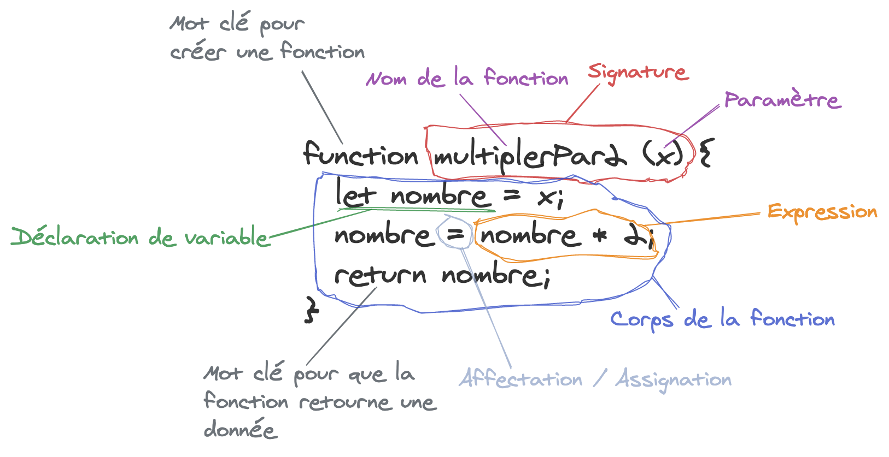

# Le plus important d'abord !

Afin de comprendre ce qui va ou ne va pas dans votre code par la suite, le plus important est de connaitre
```
console.log("bonjour, dites:")
console.log(33)
console.log(...)
```
N'importe qu'elle variable, fonction... Peut être passé en argument de cette méthode (ce qui veut dire écrit entre les 2 parenthèses). Le log est le nom utilisé en informatique pour l'action d'écrire dans le terminal. Le fait d'écrire le contenu de vos variables, du texte, le résultat d'une condition... Vous permet de comprendre comment se comporte votre code et si cela correspond à vos attentes. Mettez en partout si vous ne comprenez pas ce qu'il se passe!!

# Le second point le plus important
Le terme `expression` il est utilisé pour désigner une portion de votre code. Le plus souvent celles qui se trouvent à droite d'un signe égal `= ...` ou entre paranthèses `(...)`.
Il est important de savoir de quoi on parle et quand on parle du mot `expression` c'est de ces bouts de code dont il est question.
Il y a aussi le terme `signature`, `corps`, `paramètre`, `variable`, `retour` voici en suivant un petit visuel pour vous aider.

Le dernier mot clé à connaitre est `instruction`, il désigne n'importe quelle ligne de code de votre programme, une seule ligne cependant.